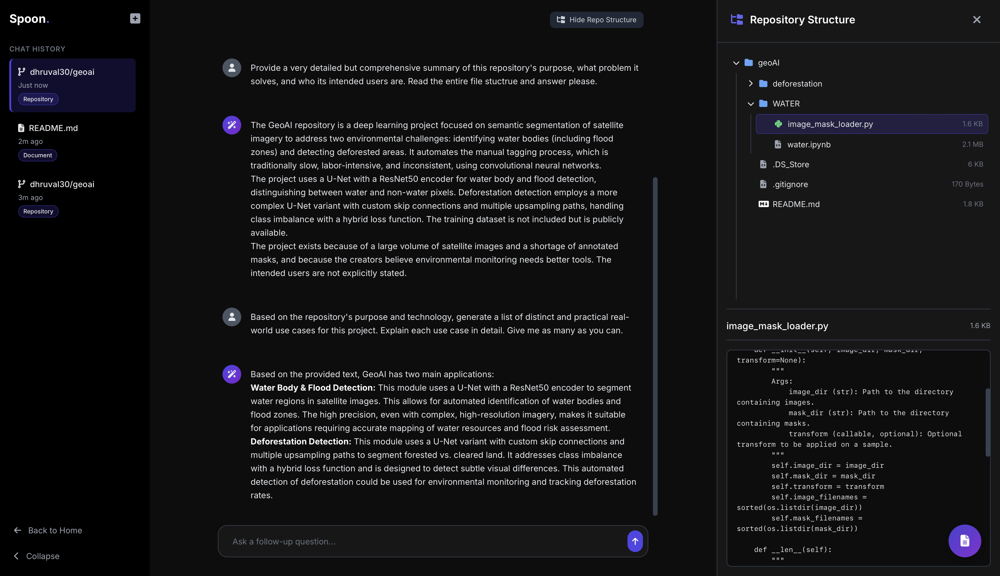

# Spoon

[https://spoon-vz8l.onrender.com](https://spoon-vz8l.onrender.com)

*Get the gist of any codebase or document.*

### What's this all about?

Alright, so what is this? Spoon is a simple web app that connects to the Gemini API to analyze code repositories from GitHub or technical documents you upload. 

It’s a functional prototype built to be a straightforward and useful tool.

### Core Features

* **Repo Analysis**: Drop in a public GitHub URL and start asking questions. What's the tech stack? What's the purpose of this file? Spoon will read through the code and give you the answers.
* **Document Analysis**: Upload a PDF, Markdown, or TXT file and ask away. Great for summarizing dense academic papers or technical documentation.
* **File Browser**: When you load a repo, you get a full file tree so you can browse the structure and preview files directly.
* **Chat History**: Remembers your previous chats in your browser's local storage so you can pick up where you left off. Could have user sessions, caching, there's a lot scope, can be a future update.

### How it Works

Shoving an entire codebase into an AI prompt is slow and often gives messy results. To make things faster and more accurate, We use a smart two-step process powered by **LangChain**.

1.  **The Planner**: First, it makes a quick request to the AI acting as a 'planner'. It looks at your question and the list of all files in the repository to decide which ones are most relevant to your query.
2.  **The Responder**: Then, it takes the content from *only* those selected files and sends it to the 'responder' AI, which generates a focused answer based on that specific context.


### The Tech Stack

This project uses a few different bits and pieces to get the job done.

| Backend       | Frontend                               |
| ------------- | -------------------------------------- |
| Flask         | Tailwind CSS                           |
| LangChain     | Google Fonts                           |
| Google Gemini | Font Awesome                           |
| PyGithub      | Showdown.js (for Markdown rendering)   |
| PyPDF2        | Vanilla JavaScript (no frameworks)     |

### Getting Started

Ready to get this running? Here’s the deal.

**1. Clone the repo**

```bash
git clone https://github.com/dhruval30/spoon.git
```

```bash
cd spoon
```

**2. Set up a virtual environment**

```bash
# On macOS/Linux
python3 -m venv venv
source venv/bin/activate

# On Windows
py -m venv venv
venv\Scripts\activate
```

**3. Install the dependencies**

```bash
pip install -r requirements.txt
```
**4. Handle your environment variables**

Create a .env file in the project's root directory. You can create a new file with the following content.

```bash
GEMINI_API_KEY="your_google_ai_api_key_here"
GITHUB_TOKEN="your_github_personal_access_token_here"
```

**How to Run It**

Once everything's installed, just run the Flask app.

```bash
python run.py
```

**The app should now be running on http://127.0.0.1:5000**





